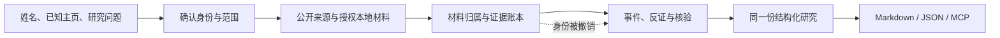

# StripSearch

**Research the person. Trace the evidence.**

从公开经历、作品与行动理解一个人，让每项判断都能回到证据。

StripSearch 是一个以身份核验和证据追溯为核心的人物研究 Agent 设计。计划提供本地 Agent、CLI 与 MCP 接口，输出带人物索引、原始链接和证据状态的 Markdown / JSON 报告。

> **当前阶段：设计基线 v0.1 + 可运行 Web alpha，2026-09-21。** 邮箱登录、研究记录、GitHub 公开资料读取和来源修订已实现并验收。Exa 适配器已实现，真实服务待配置；完整 Agent、CLI、MCP 和研究效果评测尚未交付。

**Web 入口：** [`apps/web`](apps/web/README.md) 提供同一份 canonical 报告上的真实认证、按账号隔离的 SQLite 研究作业、GitHub 公开资料读取、可选 Exa 检索与 Markdown / JSON 导出。运行方式、实际限制与未验证边界见该说明；这不代表 M1–M4 整体通过。

本轮入口：[初始化调研与实施方案](docs/initialization-research.md) · [验证记录](docs/initialization-validation.md)。探针验证程序约束与依赖兼容，不代表原 12 个研究案例或真实人物评测已通过。

## 一份好报告应该回答

1. **确定是这个人吗？** 候选、主页、材料归属与排除理由清楚；同名不合并。
2. **他实际做了什么？** 作品、贡献、选择、后续行动和结果有时间与证据。
3. **别人凭什么这样评价？** 保留原话上下文、观察关系、相反证据与未知。
4. **哪些结论还不能下？** 自述、已支持事实、冲突和分析假设分别呈现。

首个场景是公开创作者、研究者、技术作者的采访准备与作品研究。对普通个人，只处理明确授权的材料；资料稀疏时返回有限发现。项目不提供私人位置追踪、匿名身份揭露、泄露库查询或访问控制绕过。

## 设计导航

| 要了解什么 | 去哪里 |
|---|---|
| 为谁做、差异在哪里、什么值得验证 | [产品设计](docs/product.md) |
| 对外研究入口、Chat 与证据核查交互 | [Web 设计](docs/web-design.md) |
| 身份 → 行动 → 经历 → 第三方观察 → 可修订判断 | [研究方法](docs/research-method.md) |
| Agent、存档、证据依赖与失败恢复 | [系统架构](docs/architecture.md) |
| MCP、可配置首屏、人物索引与返回契约 | [接口设计](docs/interfaces.md) |
| 准确度、覆盖、数据集与对照实验 | [评估设计](docs/evaluation.md) |
| TikHub 与开源生态如何取舍 | [工具选型与调研](docs/providers.md) |
| 分阶段交付与验收 | [开发 brief / 路线](docs/roadmap.md) |

先看一份[合成报告](examples/report.md)，再对照[同一份 JSON](examples/report.json)和[请求配置](examples/request.json)。样例域名 `example.org` 是占位标识，不应抓取。

## 部署

官网与工作台共用 `apps/web`，采用 Nginx HTTPS + 单实例 Node / SQLite 部署。容器、持久化、注册控制、备份与回滚步骤见[部署说明](docs/deployment.md)。代码与容器检查不等于线上验收；实际发布版本通过 `/release.json` 核对。

## 核心设计

建议先验证 **Exa + TikHub**，在正文读取缺失时按需使用 **Firecrawl**。采集器负责取得资料；StripSearch 负责把资料归给正确的人，并约束结论能说到哪一步。具体能力与未验证项见[选型](docs/providers.md)。

## 参与与复用

- 提交设计问题或失败案例：[Issue 模板](.github/ISSUE_TEMPLATE/)。请使用合成材料或有明确许可的公开职业资料。
- 建立研究、比较方案、改变设计：[三种工作模板](templates/README.md)。
- 校验当前设计材料：`python3 scripts/check_design.py`。它检查链接、样例与数据引用；不测试网络采集或模型效果。
- 测试 Web：`npm --prefix apps/web test`；运行冻结回放：`npm --prefix apps/web run eval`。数据与评分边界见 [Evaluation 数据集入口](evals/README.md)。
- 实现从[第一个里程碑](docs/roadmap.md#m1--最小可审计闭环)开始。

项目代码、文档和原创合成样例采用 [Apache-2.0](LICENSE)。链接到的服务、网页、第三方代码与用户档案不因此获得本仓库许可。当前没有收录第三方网页全文。

---

**English:** StripSearch is a design-stage, evidence-first research agent for public professional activity and authorized materials. It separates identity linkage, observed actions, attributed statements and hypotheses. Planned interfaces are a local agent, CLI and MCP; reports share a canonical JSON model. A local authenticated Web alpha includes live GitHub metadata research and optional Exa adapters. CLI, MCP, production deployment and benchmark results are not released.
