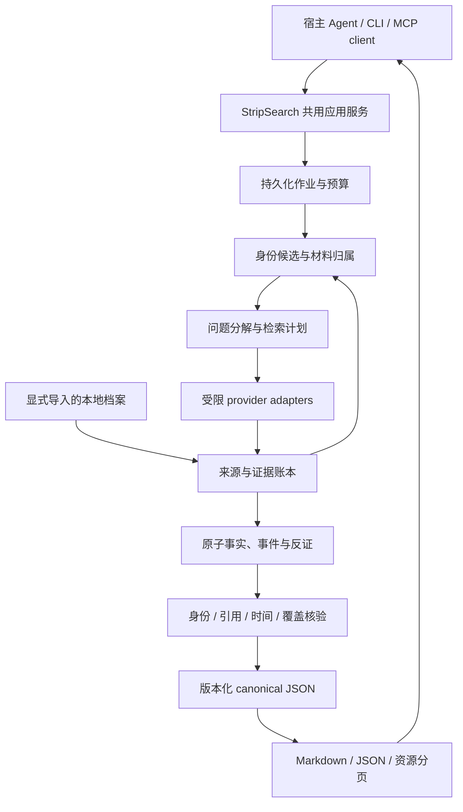

# 系统架构

状态：待实现。先做单机、单用户的可靠闭环，再决定是否需要服务化。

## 一条受约束的工作流

LLM 负责拆解问题、提出查询和候选断言；确定性程序负责授权、预算、状态迁移、引用完整性与导出。核验步骤只看到限定材料与待核事实，不接受生成步骤的自评分。MVP 不依赖多个自主 Agent 相互投票形成真值。

拟用 TypeScript、官方 MCP SDK、SQLite 和文件存档；版本在实现时锁定。一个共享 core 供 CLI 与 MCP 调用。只有出现真实并发、跨用户或查询压力后再引入队列服务、PostgreSQL 或图数据库。

## 数据与依赖

| 实体 | 关键字段 | 不变量 |
|---|---|---|
| Person | ID、显示名、身份状态、公开主页、身份证据 | ID 与姓名无关；候选不可静默合并 |
| Source | canonical URL / 内部 URI、作者、发表/获取时间、原始来源组、获取状态、hash | 缓存链接不替代原 URL；hash 不证明真实 |
| IdentityLink | person、source、状态、依据、相反证据、版本 | 只有 linked 来源可支持该人物结论 |
| Evidence | source、定位、短摘录、内容版本 | 既能指向文本，也能指向时间戳/页码 |
| Claim | person、原子断言、类别、状态、有效时间、支持/反证边 | 自述按说话者归属；未读来源不能支撑引用 |
| Event | person、时间、行动、结果及其 claim IDs | 因果、代价与贡献未知时不补全 |
| Hypothesis | 限定解释、支持/反证事件、替代解释、待验证项 | 不进入“已核实事实”栏 |
| Run | 状态、输入与配置 hash、版本、调用账、预算、覆盖、停止理由 | 失败也有记录；输出修订可追溯 |

来源与引用按版本不可变保存，人物归属可以显式修订。依赖路径为 `IdentityLink → Claim → Event → Hypothesis → Report revision`；撤销归属时先使旧版本失效，再重算受影响结论。最终导出必须拒绝引用失效结论。旧报告标记 superseded 并指向修订版，不能静默修改审计记录。

## 本地档案也是有边界的来源

1. **导入是显式操作。** 用户选择文件/文件夹，清单列出实际导入项；不自动遍历 home、知识库或浏览器会话。MCP 输入是已授权 collection ID，不允许宿主传任意本机路径读取。
2. **先切段，再记录来源。** 保留格式、hash、内部文档 ID、定位、作者/日期；无法解析与没有时间是不同状态。
3. **控制外发。** 默认不把本地原文发送给搜索/采集服务；若配置云端 LLM 处理本地摘录，启动前明确列出外发范围，需已有对应授权，否则仅用本地处理器或返回 `egress_not_authorized`。
4. **权限随证据流动。** 衍生事实和摘要继承其证据中最严格的导出限制；不能靠改写把私有材料变成公开事实。
5. **分开渲染。** 内部报告可用 `stripsearch://sources/{id}` 定位；public 导出只保留允许公开的来源与可独立支持的事实，不显示本地路径或私有材料存在的细节。
6. **可删除。** 删除 collection 时清理正文、索引、缓存和衍生报告；审计只保留非敏感删除凭据。许可/配置到期同样触发清理。

原始全文只在许可或授权允许时保存；否则保留原始链接、必要摘录与定位。运行目录默认排除版本控制，公开仓库不作为人物数据库。

## 作业、预算与恢复

`queued → resolving → researching → verifying → completed`；可分支到 `needs_input / partial / failed / cancelled`。`completed` 可以包含已经正确保留的 unknown；被未完成步骤、访问错误或预算截断的任务是 partial。范围不允许在调用外部服务前 failed。

- `start` 使用幂等键 + 配置摘要；同键同配置返回已有 run，不同配置报 conflict。
- 每次 provider 调用先记录意图和预算预留，再调用，最后记录响应与实际费用。未知账单记 unknown。
- 能确定单次费用上界时才允许承诺硬成本上限；否则用请求数/页数限制或返回 `budget_unverifiable`。
- 网络断开后的已计费状态可能未知；不承诺跨供应商 exactly-once。没有供应商幂等能力时标 `outcome_unknown`，避免无声重放造成双倍费用。
- 取消阻止后续调用，尝试中止正在执行的请求；无法中止的请求可能继续计费，账本必须保留。
- 重启从已确认的 checkpoint 恢复；等待身份补充时释放执行资源。`resume` 明确绑定确认内容和版本。

## 接入隔离

对外只暴露少量稳定的研究工具，对内用 REST/SDK 或经过 allowlist 的上游 MCP 适配器。工具名与参数在接入时验证；不用一个通用“执行任意 OSINT 工具”的入口。

网页与文档是数据，不是操作指令。抓取只允许 HTTP(S)，解析 DNS 与每次重定向都检查本机、内网和元数据地址；限制大小、时长、跳转与域名速率。会话凭据不得出现在 prompt、日志、报告或错误栈中。登录/验证码/付费限制记录 inaccessible。

首发 stdio；远程 HTTP 在第二阶段实现独立用户空间、资源鉴权、速率限制和 OAuth 兼容验证。未达到这些要求不能把本地 server 直接开放到公网。
