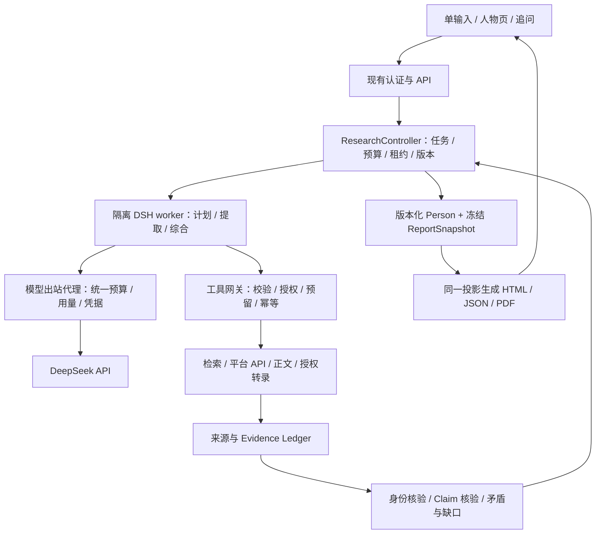

# 技术设计：DSH 执行层与可修订 Person Object

状态：待实施设计。DSH 指 DeepSeek Harness；DeepSeek 模型 API 是其推理后端。二者都不能直接替代人物研究领域模型。最新能力、固定版本和价格见 [来源](SOURCES.md) 与 [成本设计](COST-EVAL.md)。

## 1. 架构裁决

推荐 **现有 TypeScript Web + 持久 ResearchController + 隔离 DSH worker + 窄工具网关**。不是把官网换成 DSH Web UI，也不是让模型持有数据库、任意 shell 或所有 API 密钥。

| 方案 | 优点 | 缺点 | 裁决 |
| --- | --- | --- | --- |
| 直接 DeepSeek SDK + 自建 loop | 依赖较少，行为完全可控 | skills、sessions、MCP 与上下文工程需要自建 | 对照基线与可替换降级路径 |
| DSH 自定义 profile + 领域 Controller | 复用 Agent loop、工具/MCP、上下文和会话机制 | developer preview；需锁版本、隔离权限 | 推荐，符合本次用户方向 |
| 通用多 Agent 全权研究 | 演示快、探索广 | 费用、重放、互相污染和错人难控制 | 不作为 MVP |



DSH 负责提出和执行已授权工具步骤；Controller 保留唯一状态权威。worker 可以重建，人物资料与调用账不能随会话丢失。DSH 的 session persistence 保存对话，不等于外部付费调用的事务日志。

所有模型 adapter 的出站必须经同一预算代理，包括 root、child、compaction、重试和 native search。网络策略禁止 worker 绕过网关直连供应商，worker 不持真实供应商 key。每条模型请求先在全局 ledger 预留，代理收到 usage 后结算；不能只给显式 MCP 工具计费。若某插件不能通过预算代理，则禁用该插件，不能仅靠结束后的统计宣称有硬上限。

### 当前 DSH / DeepSeek 能力与实现注意

核对到 DSH 固定提交 `477b4f420553e8a52c2fbccc464d7561b239c443`（2026-09-24，0.1.7-rc.2 合并），仍为 developer preview。使用同版 runtime、SDK 和插件，升级先跑契约测试，不能自动跟随 master。

当前 `deepseek-flash` 路由至 V4.1 Flash，支持视觉、1M 上下文和 384K 最大输出；`deepseek-v4-pro` 当前继续提供。大窗口只是能力上限，不是研究默认预算。Flash 默认承担路由、提取与综合；Pro 只有同预算实测有增益才升级，不能仅凭名字判断更好。[模型与价格](https://api-docs.deepseek.com/quick_start/pricing/)

当前 Responses 提供 `text.format: json_schema`；Chat JSON mode 与 `/beta` strict tool calling 是不同能力。任何路径均需服务端语义校验。Responses 的 previous_response_id/background/store 和内建 web_search 等存在兼容限制，不能照搬其他供应商的 session 语义。工具循环的 reasoning_content 交给经过测试的 adapter 保留。[结构化输出](https://api-docs.deepseek.com/api/create-response/) · [兼容边界](https://api-docs.deepseek.com/guides/responses_api/) · [工具调用](https://api-docs.deepseek.com/guides/tool_calls/)

DSH Workflow 没有跨重启 journaling/resume 或全局 token-budget 语义。TS SDK 当前没有 mid-turn cancel；`finalResponse` 是到 idle 为止最后的 assistant 文本，不能用它证明某个任务完成。因此每个 job attempt 使用独占 runtime；取消先撤销工具权限/预算，再关闭该 runtime；完成只接受 schema 与证据验证通过的 `submit_stage_result` 收据。[Workflow](https://github.com/deepseek-ai/deepseek-harness/blob/477b4f420553e8a52c2fbccc464d7561b239c443/packages/workflow/workflow/README.md) · [SDK](https://github.com/deepseek-ai/deepseek-harness/blob/477b4f420553e8a52c2fbccc464d7561b239c443/packages/sdk/client/README.md)

DSH 有 Exa 等 search provider 与 HTTP fetch provider，也有通过 Anthropic-compatible Messages 调用的 DeepSeek native search；一次 native search 额外产生完整模型轮次，不能视为免费，也不能与 Responses 忽略 web_search 的限制混淆。先采用可计量的检索路径，native search 用同题对照验证后再启用。MCP structuredContent 可用于类型化结果；耗时任务采用自身 start/poll API，不依赖尚不支持的 task-required extension。[Web](https://github.com/deepseek-ai/deepseek-harness/blob/477b4f420553e8a52c2fbccc464d7561b239c443/packages/web/web/README.md) · [Native search](https://github.com/deepseek-ai/deepseek-harness/blob/477b4f420553e8a52c2fbccc464d7561b239c443/packages/web/web-search-deepseek/README.md) · [MCP](https://github.com/deepseek-ai/deepseek-harness/blob/477b4f420553e8a52c2fbccc464d7561b239c443/packages/mcp/mcp-client/README.md)

## 2. 输入、身份与图谱

建议 InputEnvelope：`rawInput, normalizedKind, anchors[], intent, locale, inputRevision`。kind 区分 profile_url、content_url、person_query、authorized_identifier；用户多链接不直接合并。接口不接受客户端指定任意 provider URL 或 shell 命令。

`resolve_input` 先做确定性 URL/平台解析，必要时再用小模型解析自然语言。`resolve_anchor` 必须产生内部 anchorId、canonical URL、页面类型、作者角色与读取状态，并尽可能取得平台 stable ID。独立网站或无法公开取得 ID 的平台允许 platformUserId=null，以 URL + 内容版本记录锚点，不伪造平台 ID；其归属证据单独判断。确认的是账号/主页锚点；自然人和跨平台身份另外建 link。

Person 使用租户内 opaque ID，不用姓名/邮箱作为主键，不建立默认跨租户的全局私人画像。Account 记录 platform + 可空 platformUserId + canonicalUrl、历史 handle 与有效时间；内部 accountId 独立生成。IdentityLink 有 proposed / supported / disputed / rejected / revoked 状态、依据、反证和 policyVersion；模型生成的分数不是校准概率。

第一层扩展是账号自述里的明确链接和公开作品署名；第二层是职业上下文和独立互证；同用户名工具只产生候选。只研究主体的相关公开互动，其他人最小化保留为上下文，不递归调查其人际网络。

初始上限建议：账号候选最多 12 个，重点账号最多 4 个，外部关系深度 1；上限是可调实验配置而非覆盖承诺。源数和扩展数均受全局任务预算约束。身份强度与研究价值分为两个轴：属于此人但无内容可以不深挖；内容丰富但不确定归属不能支持此人结论。

## 3. Person Object：稳定引用，版本化事实

不要维护一个让模型反复覆盖的巨大 JSON。存储归一化实体，按 revision 组装结构化对象；“大”表示覆盖丰富，不意味着每个响应必须装入全部原文。

| 实体 | 核心字段 | 不变量 |
| --- | --- | --- |
| Person | personId, tenantId, revision, displayName, anchorAccountIds | 名称可变，ID 稳定；分裂/合并显式留记录 |
| IdentityLink | accountId/personId, evidenceIds, conflicts, status, validTime | 归属可撤回，不因用户选择就升级为已核验 |
| Source | canonicalUrl, authorRole, publishedAt, fetchedAt, contentHash, access/rights | 原始 URL 保真；已搜到与已读正文分离 |
| Evidence | sourceRevision, locator, excerpt, language, transcriptConfidence | 页码/段落/时间戳可定位；短引文不能脱离上下文 |
| Claim | subjectId, predicate, value, kind, support/refute IDs, validTime | fact/self_report/analysis 分开；不得引用失效材料 |
| Event/Observation | action, context, response, followThrough, claimIds | 不补造动机、因果或团队贡献 |
| Unknown/Conflict | question, impact, attemptedActions, alternativeAccounts | 无结果不等于不存在；反证不藏在底层日志 |
| ResearchRun | input, taskLens, state, budgets, steps, lease, checkpoints | 每一步可恢复、计费和取消有收据 |
| ReportSnapshot | reportId, personRevision, asOf, lens, scope, policyVersion, status | 只读快照；一套内容生成所有格式 |

建议对外对象为 `person-object/v2`，大数组通过分页资源读取。示意结构不是完整 JSON Schema：

```json
{
  "schemaVersion": "person-object/v2",
  "person": {"id": "p_synthetic", "revision": 3, "anchorAccountIds": ["a1"]},
  "identityLinks": [],
  "claims": [],
  "events": [],
  "observations": [],
  "unknowns": [],
  "conflicts": [],
  "sources": [],
  "report": {"id": "r_synthetic", "personRevision": 3, "lens": "overview", "status": "partial"},
  "provenance": {"methodVersion": "proposed-v2", "priceVersion": "2026-09-26"}
}
```

建议私有工作目录结构如下，目录名使用 opaque ID；JSON 为规范数据，正文按许可保存，导出不携带本机路径：

```text
people/{personId}/
  manifest.json
  revisions/{revision}/person.json
  revisions/{revision}/claims.jsonl
  revisions/{revision}/identity-links.jsonl
  sources/{sourceId}/metadata.json
  evidence/{evidenceId}.json
runs/{runId}/
  request.json
  actions.jsonl
  checkpoints/{stepId}.json
  usage.jsonl
reports/{reportId}/{revision}/
  report.json
  report.html
  report.pdf
```

生产首版仍可用 SQLite + 受控对象文件，图关系使用关系表和索引；不先引入图数据库。多 worker 写入使用 lease + expectedRevision/CAS；失效 worker 的迟到结果不得覆盖新版本。未来数据库迁移由实际并发推动。

## 4. 受限工具契约

平台差异隐藏在同一工具结果契约下：status、contentRef、canonicalUrl、authorRole、nextCursor、coverage、limitations、requestId、billingReceipt。工具不能直接修改最终事实，只提交候选数据，由领域服务校验写入。

| 工具族 | 职责 | 返回限制 |
| --- | --- | --- |
| resolve_input / resolve_anchor | 输入分类、账号读取、内容角色识别 | 不自动合并自然人 |
| search_candidates / discover_sources | 查询候选和相关来源 | relevance 不当 identity probability |
| fetch_profile / list_content / fetch_thread | 读取资料、分页、父子互动链 | 页数/字节/时间限制；保留缺页 |
| read_document / get_transcript | 正文与已有可访问转录 | 不绕付费/登录；转录成本单计 |
| propose_identity_link / extract_claims | 提议归属与原子断言 | 必须引用存在的 evidenceId |
| verify_claims / inspect_gaps | 身份、时间、支持、反证核对 | 不能用生成者自评分代替验证 |
| query_person / get_evidence | 复用已有快照和证据 | 读操作不隐式发起付费检索 |
| finalize_snapshot | 请求生成快照 | Controller 决定能否发布 |

MCP 是适配与宿主接口，不作为可信授权边界。服务端绑定 tenant/run，模型不可指定别人的 owner。对接的 MCP server 需允许名单、锁定工具 schema 和最小凭据；工具数量按平台按需加载。

平台策略采用一个总研究 skill 加小型平台指南：X 读父帖/引用与纠错；GitHub 从 issue/PR 追到提交；博客追版本与原出处；LinkedIn 对职业自述保留属性；YouTube/采访区分主持人和受访者、保留时间戳。不同指南不各自定义事实真值规则。

## 5. 真正的深度研究循环

```text
admit → resolve anchor → load existing person → plan gaps
→ reserve bounded action → execute → ingest → verify attribution
→ extract atomic claims → check support / conflicts / time
→ checkpoint → decide next useful action → finalize snapshot
```

下一步由有价值的缺口或矛盾触发，而不是固定“所有平台各查一次”。采访需先找完整可访问文字/转录，标记说话人、时间和上下文，再提取观点与回应；同一采访的转载归为同源组，不当多份独立证据。

停止规则：约定维度已处理、连续两次无新增合格证据、预算/时长/调用次数用尽、来源不可访问或用户取消。分别记录 stopReason，不用模型一句“已足够”代替限制。无新增证据可以结束为有限覆盖；必需步骤被中断则 partial。

身份仍有多个人选时，不发布确定自然人的 completed 报告。可交付 account-scoped partial，并清楚说明范围。completed 允许 unknown，但必须完成约定步骤、引用核验和预算结算状态记录。

状态机建议：`queued → resolving → researching → verifying → completed`；可进入 needs_input、partial、failed、cancelled。needs_input 不占 worker；resume 绑定输入与人物 revision。取消停止调度新调用，保留已在途可能继续计费的事实。

## 6. 付费调用与重启恢复

每次调用先写 actionId、idempotencyKey、参数摘要、费用上界/预留、状态 requested，再访问供应商；回包登记 requestId、usage、状态、内容引用。供应商无幂等且响应丢失时标 outcome_unknown，不自动重放。区分 planned、reserved、charged、estimated、unknown，不用 0 表示未知。

恢复从领域 checkpoint 读取已完成动作与证据，不从模型长对话猜进度。CAS 提交步骤和输出；持久 run lease 防并发重复执行。DSH session 丢失可根据受限摘要和 evidence IDs 重建；不要求重新读取全部原文。

关闭 DSH runtime 只终止本地执行，不保证已经发出的供应商请求停止计费。迟到响应仍更新调用账与费用收据，但不得继续发布内容或调度衍生动作。

## 7. 权限、网络与撤回

自定义 DSH profile 移除通用 shell、全盘读写与任意网络；只挂载一次运行的工作目录，使用隔离 worker 与受限工具网关。网页视为不可信数据，网页中的指令不能改变工具权限、预算或系统目标。DNS、每次重定向、私网/元数据地址、响应大小和时长均由抓取服务检查。

关闭 DSH 默认 DeepSeek session-log contributor，另写脱敏的业务事件收据。关闭日志不等于 prompt 不外发：发送给云端模型的摘录仍是外发数据；私有/授权材料的 provider、保留期与外发范围需受用户设置约束。供应商密钥只在网关，不放入模型上下文或导出。

固定提交中 `session-log-deepseek` 的 enabled 默认 true；自定义 profile 定位现有 `@deepseek-ai/dsh-session-log-deepseek` 插件条目，将其 `config.enabled` 设为 `false`，或直接不挂载。具体 patch selector 随固定 profile 核对，不新增第二个同名实例。出站测试断言没有 `dsh_session_log`。不要直接使用默认带 shell / danger-full-access 的 sdk-minimal。开源 DSH 可自部署，不等于云模型零留存或普通主机可以经济地自托管相同模型。[日志实现](https://github.com/deepseek-ai/deepseek-harness/blob/477b4f420553e8a52c2fbccc464d7561b239c443/packages/session/session-log-deepseek/src/index.ts#L38-L55) · [最小 profile](https://github.com/deepseek-ai/deepseek-harness/blob/477b4f420553e8a52c2fbccc464d7561b239c443/packages/bundle/sdk-minimal/README.md) · [安全说明](https://github.com/deepseek-ai/deepseek-harness/blob/477b4f420553e8a52c2fbccc464d7561b239c443/SAFETY.md)

撤回链：IdentityLink/Source → Claim → Event/Observation → Report。旧在线快照标 revoked/superseded，未来导出拒绝失效内容；内容缓存/派生缓存同步失效。已下载 HTML/PDF 无法远程收回，因此附 revision、asOf、状态入口并明确是时间快照。

默认 tenant-scoped 缓存；只有许可允许、无用户 query/私人信息、可公开复用的原始内容才能经单独审查加入公共缓存。删除人物/证据时清理相关派生内容、索引与 worker session，保留非敏感删除凭据。

## 8. 输出与迁移

先按授权与身份过滤出 SnapshotProjection，再由确定性渲染器生成 JSON/HTML/PDF。HTML 转义来源文本、禁用外部脚本和自动外链加载；PDF 只渲染本地受控模板，避免用户 URL 引发 SSRF。三个格式引用同一 claim/evidence ID 集合和 revision，排版不得改变事实。

旧 `web-alpha/v1` 记录只转成 legacy report，不从旧摘要反推“已核验事实”。逐步加 v2 表和 API；旧 reader/export 保持兼容。现有 runner 调度、认证/Origin、取消、SSE 和来源修订保留，provider.run 拆成小动作。

建议新 API：`POST /api/research` 接单输入；`GET /api/people/:id` 分页资料；`GET /api/runs/:id/events` 复用；`POST /api/runs/:id/resolve` 消歧；`POST /api/people/:id/questions` 先读现有证据；`GET /api/reports/:id/export` 绑定 format + revision。名称为提案，需先冻结 schema 再实施。

外部 CLI/MCP 复用同一应用服务，不另造 Person 或成本语义。先验证 Web 闭环，再验证两个 MCP 宿主；不能用 tools/list 成功宣称完整研究已验收。
