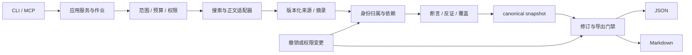

# 初始化调研与实施方案 · 2026-09-20

**建议：先做一个可撤销、可复核的本地证据核心，再接人物研究工作流。** TypeScript + SQLite + canonical JSON 的方向保留；搜索服务可替换，MCP 作为薄适配层。离线探针只验证程序约束，真实人物研究能力仍待验证。

本次基线：`c70cbcb76b3f7f27858533c5cb439f982db079f0`。已读取项目空间的产品、Agent/MCP、验证路线与模板摘要，并对照仓库全部七篇设计、样例、12 个种子及静态检查。项目空间没有提供独立视觉设计文件；这里的“按设计稿初始化”是按已有产品与技术设计推进，不宣称实现了未提供的 UI。

## 1. 当前有什么，缺什么

| 设计输入 | 已明确 | 实施前缺项 |
|---|---|---|
| [产品](product.md)、[研究方法](research-method.md) | 采访准备/作品研究；身份、行为、自述、评价分层 | 用户完成一次核查的具体路径与用时基线 |
| [架构](architecture.md) | 共用 core、身份撤销、权限继承、持久作业 | 可执行 schema、依赖闭包、事务边界、并发写入规则 |
| [接口](interfaces.md) | 七个窄工具、canonical JSON、只读 get | 字段级来源、版本状态、分页失效、SDK 版本锁定 |
| [providers](providers.md) | Exa / TikHub 优先，Firecrawl 按需 | 端点级真实可用性、来源定位、分页与费用证据 |
| [evaluation](evaluation.md)、[数据卡](../evals/README.md) | 质量、覆盖、核查成本分开；三层试验 | 人工裁决、检索回放环境、配对基线、真实结果 |
| [路线](roadmap.md)、[样例](../examples/report.json) | M0–M4 与原创合成材料 | 尚无生产运行时、安装包、完整研究回放或宿主验收 |

原静态检查通过，仅证明文档链接和手写样例的结构一致。十二个案例始终保持 `discovery / unreviewed`；不能因本次探针通过而改成 benchmark 已通过。

## 2. 产品流程如何落地

第一次使用只收：已知公开主页、研究问题、时间截面。姓名是展示信息，不是主键。输出顺序：

1. **身份确认**：候选分别显示；一条明确的补充线索优先于长篇追问。确认目标只表示研究意图，不证明此人的全部自述。
2. **研究进度**：显示当前阶段、已读取来源数、预算与阻塞；已有片段标 provisional。缺资料与访问失败分别显示。
3. **按问题给答案**：事实/归属陈述/解释分层，每条保留状态、时间及引用；无法回答也占据问题位置。
4. **核查链**：点击断言 → 对应短摘录和定位 → 原来源；同时能看到相反证据和来源簇。
5. **纠错和修订**：否定某个来源归属后，显示失效范围、新 revision 和仍成立的部分；旧导出不能继续作为当前事实提供。

首发 CLI/宿主呈现即可；需要图形界面时，围绕“问题列表—报告—证据详情”布局，而非先做人物评分仪表盘。资料不足时交付事件账本或有限发现。只有长期使用反馈确实需要，才加入作品视图与时间线交互。

## 3. 技术选型与官方资料核对

查询日期为 2026-09-20；版本是本次注册表观测值，不是未来的 latest 承诺。

| 层 | 方案 | 核对结果与取舍 |
|---|---|---|
| 生产语言 | TypeScript，core 不依赖 MCP/CLI | 延续设计。npm 查询 TypeScript `7.0.2`；本次没有做 TS 编译验证，不把查询值称为已验证编译工具链 |
| MCP | 官方 v2：server/client `2.0.0`；Zod `4.6.5` | 官方主分支声明 v2 稳定，使用分包；保留 v1 SDK `1.30.0` 做兼容 smoke。仓库原 2025-11-25 是明确旧基线，不能混用两个代际 import。[官方 SDK](https://github.com/modelcontextprotocol/typescript-sdk) |
| 运行时 | 本机 Node `22.23.2` | v2 engines ≥20，better-sqlite3 `13.0.3` engines ≥22；仅本机兼容验证，发布仍需 Linux/macOS/Windows 矩阵 |
| 存储 | SQLite；生产候选 better-sqlite3 `13.0.3` | 原子保存修订与状态；网络调用不放在数据库事务中。Node 22 自带 SQLite 仍标 active development，本轮不把它作为稳定默认。[Node 文档](https://nodejs.org/download/release/v22.23.2/docs/api/sqlite.html)、[驱动 API](https://github.com/WiseLibs/better-sqlite3/blob/master/docs/api.md) |
| 离线逻辑探针 | Python `3.12.14` + sqlite3 + unittest | 零第三方依赖；验证依赖和事务，不改变生产 TS 方向。[sqlite3](https://docs.python.org/3.12/library/sqlite3.html) |
| 作业调度 | 持久业务 job + get/resume/cancel | 原协议基线的 Tasks 属实验能力，不让研究恢复依赖宿主支持。[2025-11-25 Tasks](https://modelcontextprotocol.io/specification/2025-11-25/basic/utilities/tasks) |

SDK smoke 的锁文件与脚本在 [runtime_compat](../probes/runtime_compat/README.md)。它只证明包与传输能完成本地调用，不等于七个工具已实现或两个宿主已经通过验收。v2 文档与旧接口基线的差异应在 M3 专门兼容验收后冻结，不静默升级对外协议承诺。

### 服务组合

| 服务 | 明确职责 | 必须实测的风险与配置 |
|---|---|---|
| [Exa Search](https://exa.ai/docs/reference/search) | 发现候选网页，按需内容读取 | 响应有 requestId / costDollars 字段；按实际响应记录，不能用文档示例费用作为预算证明；链接排名不构成身份归属 |
| [TikHub Rednote](https://tikhub.io/xiaohongshu-api) | 已确认公开账号的作品与评论读取 | 当前推荐 App V2，旧 App V1/Web/Web V2 弃用；cache_url 有时效，不能当原始证据 URL。父评论、时间、游标与全文完整性逐端点验证 |
| [Firecrawl Scrape](https://docs.firecrawl.dev/api-reference/endpoint/scrape) | 已知 URL 正文缺失时补充 | `onlyMainContent` 默认 true；可能排除评论与页面旁注，证据采集需按页型配置。不能把清洗后正文当所有内容，也不默认开启额外 LLM 清洗 |
| [Tavily Search](https://docs.tavily.com/documentation/api-reference/endpoint/search) | Exa 的对照替换 | 同题同预算比较；固定 search_depth，关闭自动参数变化，并请求 usage。结果片段和自动 answer 不能冒充已读原文 |

**选择依据是职责匹配，不是质量排名。** TikHub 无真实接入结果；本轮不重复未认证探测，也不因 403 判断服务失效。优先 Exa 后 TikHub，Firecrawl 只对正文缺口调用；通过共同 `origin_group_id` 去重，避免多供应商重复计作独立证据。

### 复用现有项目还是从零做

| 候选 | 能借鉴什么 | 本次决定 |
|---|---|---|
| [GPT Researcher](https://github.com/assafelovic/gpt-researcher) | 计划、采集、报告工作流和网络/本地研究 | 作为基线候选；不假设它已经提供本项目的身份撤销与权限语义 |
| [Local Deep Research](https://github.com/LearningCircuit/local-deep-research) | 本地模型与搜索集成 | 可作为 B1 替代；不要把其公开 QA 分数套到人物研究上 |
| [Verified Person Research](https://github.com/liewcf/verified-person-research) | 人物时间线、来源与不编造的写作约束 | 研究方法参考，不作为数据库、授权和修订核心 |
| [Open Deep Research](https://github.com/langchain-ai/open_deep_research) | 研究流程与评估思路 | 官方仓库显示 2026-08-21 已归档；不选为需持续维护的默认底座 |

因此自己实现小型证据 core 与适配器接口；通用研究框架先用于对照。只有真实基线证明编排能力不足时再引入重型 agent 框架，避免把多个模型互相同意误当真值。

## 4. 应先补上的六个设计缺口

### 4.1 撤销状态与事实状态分开

`supported / conflicting / insufficient_evidence` 说明证据如何支持断言；`active / invalidated` 说明该节点能否使用。归属被撤销不是该事实必然为假，不应自动写成 contradicted。失效原因记录为结构化依赖 ID 和 revision，重新验证后才生成新活动节点。

### 4.2 “不可变快照”与“不能继续导出旧结论”并不矛盾

历史 snapshot 内容不原地改写；另存 revision 状态与 current 指针。在同一事务内写新快照、标旧版 superseded、移动指针。读取指定旧 revision 也必须先过状态/权限门禁；审计读取与普通导出分离。资源 URI、分页 cursor、缓存都绑定 revision 与 policy version。已下载的旧文件无法技术上召回，必须让导出带修订标识，并在可控读取入口拒绝旧版。

来源原网页后来不可访问，不自动否定已合法保存的可核验历史快照；本地证据被撤回、清除或失去使用权限则需要合法的来源失效操作，先关闭旧出口，再生成保留旁支的新报告。仅验证“坏输入不能插入”不足以覆盖这一转移。物理删除和所有衍生缓存清理仍属于 M3 的独立验收。

### 4.3 身份依据本身也有依赖

新材料的归属若依赖另一来源，撤销其依据时要继续传播。不能只删该来源直接支持的 claim。跨来源链必须有显式锚点，A 依赖 B、B 依赖 A 不能互相认证。合成探针的 `linked` 属于输入标注，不能证明真实身份核验算法正确。

### 4.4 权限继承需要覆盖自由文本

不仅 claims：profile、人物名称、事件 context、hypothesis alternatives、unknowns、问题文案、标题和摘要也可能衍生自受限材料。生产契约需加入 `derived_from` 和授权版本。没有可追溯来源的衍生文案不能进入 public 报告。混合公私证据默认整项不公开；若要保留，必须以公开证据重新做支持判断，而不是删掉私有边后沿用 supported。

探针允许保守删除，但正例必须保留独立公开分支。MVP 的安全取舍可能降低覆盖，因此端到端评测必须同时计覆盖，不能仅报零泄露。

### 4.5 身份、引用存在、引用支持是三种验证

一个引文真的出现在正文，不代表它支持结论；URL 可打开也不代表属于这个人。分别保存 identity decision、exact locator/snapshot check、entailment verdict。模型可以提出判断，但不具备修改预算、权限或旧版状态的能力。自述只支持“他说过”，不能直接升级为销量/能力事实。

### 4.6 预算账本要先于真实网络适配器

每次外部调用先预留请求/页面与可验证费用，再记录成功、失败或 outcome_unknown。重试仍消耗预算；发生不确定扣费时不能自动重放。费用未知保持 null，避免被 0 隐藏。取消的含义是阻止后续调用，不能承诺已发出的请求免费。SQLite 事务应短小，持久调用意图后再发网络请求。[SQLite 事务语义](https://www.sqlite.org/lang_transaction.html)

## 5. 生产实现蓝图（提案，未创建这些模块）

| 模块（拟建） | 输入/输出 | 应拥有的规则 |
|---|---|---|
| contracts | request / canonical / tool envelope | enum、外键、日期、版本、错误与迁移；不能用 TS 类型替代运行时校验 |
| core/identity | seed/candidates + evidence → versioned links | 同名分离、证据链、过期与撤销 |
| core/ledger | sources/evidence/claims/events/hypotheses | 只追加版本、hash 与定位、反证边、无悬空引用 |
| core/jobs | command → run/event stream | 幂等、合法状态迁移、预算、checkpoint、取消 |
| core/export | snapshot + policy → JSON/Markdown | 当前 revision、权限闭包、确定性渲染，禁止网络 |
| storage | transaction/repository | migration、外键、run 级写序列化、唯一当前 revision |
| adapters | search/read/page → normalized result | provider schema、原始 URL、状态、调用账，不决定人格/事实真伪 |
| cli / mcp | 参数与协议 ↔ application services | 权限不绕过 core；stdout 只留协议；错误兼容 |

SQLite 生产表建议：persons、source_versions、evidence、identity_decisions、claims、dependency_edges、runs、run_events、provider_calls、report_revisions、collections/policies。先按 run 保存 canonical 快照再逐步规范化必要查询；不在第一版建通用图数据库。文件快照使用内容 hash 定位，保存与清理遵循许可。

状态机仍是 `queued → resolving → researching → verifying → completed`，带 needs_input / partial / failed / cancelled。needs_input 只接受相符的 resolution_revision；read/render 不改变状态。完成可以有合理 unknown，预算截断必须 partial。模型输出先作为 proposal，经过确定性校验与语义核查后才发布快照。

## 6. 实施顺序与验收

| 工作包 | 依赖与交付 | 验收 |
|---|---|---|
| M1a 契约与门禁 | schema、身份/证据依赖、导出规则 | 本次探针的反例迁移成生产测试；旧版、断裂引用、私有衍生文案不能绕过 |
| M1b 固定语料闭环 | fixture reader、LLM proposal、核验器、两个 renderer | 十二个种子逐例执行；人审未完成则保持探索性，不宣布 benchmark |
| M1c 存储与作业 | SQLite migrations、幂等、恢复/取消 | 崩溃后恢复、不重复扣预算、同键不同请求冲突、重启拒绝旧版 |
| M2 providers | Exa 后 TikHub，必要时 Firecrawl | 固定 30 页矩阵，原 URL/正文/分页/失败/费用全部留账 |
| M3 宿主与本地档案 | 七个工具、授权 collection、stdio | 两个真实宿主完成全流程；private/public 和 egress 负例通过 |
| M4 收益实验 | 同预算基线、分组数据与人类任务 | 硬错误单独否决；覆盖、核查时间与成本共同报告，不能只报篇幅 |

以上是依赖顺序，不是工期承诺；没有真实凭据、已裁决数据和宿主测试时不填写相应完成标记。

### 30 页 provider 契约试验的预注册

普通网页 10：原始主页/公告/作品页 4、动态正文 2、多语言 2、时间变化或转载 2。社交公开页 10：账号 2、图文 3、视频页元数据 1、评论/子评论 4。分页与失败 10：多页 3、空结果 1、限制访问 2、rate limit 1、超时 1、重定向 1、缓存过期 1。实际页面名单需在授权与许可确认后冻结；本轮没有访问此矩阵。

每次记录 provider/version、端点、query 或 URL、request_id、状态、原链接、retrieved_at、正文范围/定位、游标、排序、origin group、延迟、观测费用与未知项。预定义全量/部分/不可读，API 200 不等于完整获取。用正常、边界、失败 fixture 先锁住 adapter 契约，然后再执行真实付费批次。

### 原 12 个种子的执行状态

| 案例 | 后续验证重点 | 本次状态 |
|---|---|---|
| ss-001–003 | 种子、同名、公开笔名 | 材料静态校验；未跑研究任务 |
| ss-004–006 | 转载独立性、时效、冲突 | 材料静态校验；未跑研究任务 |
| ss-007–009 | 自述、缺失、不可访问 | 材料静态校验；未跑研究任务 |
| ss-010–012 | 注入、双格式、范围拒绝 | 材料静态校验；未跑研究任务 |

本次探针有独立 case ID；覆盖某类程序约束不等于相应 ss case 已经完成语义研究。

## 7. 本次验证结果

本地结果：33 项单元测试与 23 个合成案例的 134 项检查通过；MCP 两代 SDK 本地调用与 SQLite rollback 通过。初稿曾被额外反例否决，修复记录、原始回执与适用范围见 [验证记录](initialization-validation.md)。探针决策见 [实验预注册](initialization-decision.md)。

结论限定为：共享 canonical report 与导出/修订门禁在明确标注的离线案例上得到支持，可以据此进入 M1 的生产契约实现。文案来源、公开身份依赖闭包和正文撤回是新增的必要约束；缺少它们的第一版实现不成立。不能由此推导“模型研究更准确”或“比通用研究工具更好”。

本次没有运行付费采集、模型研究、真实人物基准、两个真实 MCP 宿主或用户核查时间试验。编码委派使用模型，不属于 StripSearch 研究调用，不能混作研究成本或性能数据。
