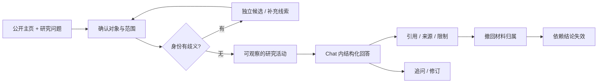

# StripSearch Web 设计

状态：交互设计原型；真实研究服务仍未实现。本设计不改变既有 M1–M4 验收。

已交付：[最终交互原型](../design/web/index.html) · [设计规范](../design/web/DESIGN.md) · [验证记录](../design/web/VALIDATION.md)。

## 访问者与入口

访问者正在准备采访、理解作者的作品，已有一个公开主页，但不确定材料是否属于同一个人、观点是否有实际行动支持。首页需要让其理解：这里既能提出研究问题，也能逐条复核回答依据。

核心承诺沿用产品设计：**理解一个人，沿着证据走。** 感受应是精确、可控、有探索欲；下一步是输入公开主页与问题，或打开合成示例。

“持续归属核查、反证和撤回”是待验证的产品差异，不宣称已优于竞品。原型中的运行状态、报告与来源均为合成演示。

## 两个视觉方向

| 维度 | A · Evidence Terminal | B · Research Observatory |
|---|---|---|
| 主张 | 每一项判断都可以沿证据回溯 | 在时间与上下文中阅读一个人的公开工作 |
| 比喻 | 研究终端，逐步连接问题与证据 | 研究档案，逐页揭示事件与材料 |
| 空间 | 非对称网格、宽输入、编号证据轨道 | 目录边栏、编辑式阅读区、时间切片 |
| 优先内容 | 提问、研究活动、可点击引用 | 研究对象、档案目录、历史变化 |
| 识别交互 | 点击结论引用，证据定位随之展开 | 沿时间选择事件，同时显示同期材料 |
| 避免 | 黑客电影、打字雨、监控大屏、伪终端日志 | 新闻门户、静态 PDF、普通博客 |

已在 Open Design 生成并实际查看 A/B 的桌面首屏、研究内容与 390px 手机折叠。选择 A，保留 B；不把配色变体算作两个方向。

### 渲染后的取舍

| 观察 | A | B |
|---|---|---|
| 1440 × 900 首屏 | 左主张、右研究框，按钮可见 | 档案式纵向首屏，按钮低于首屏 |
| 产品识别 | 编号来源与证据轨道直接表现核查 | 时间切片更适合阅读历史档案 |
| 情绪 | 黑底荧光绿、角线、细网格，更接近黑客研究终端 | 琥珀色与编辑式留白更安静 |
| 390px 首屏 | 边界说明占高过大，需要收紧 | 标题与表单纵向距离较大 |
| 工作台 | 原稿在落地页下方，需改独立视图 | 同样有过长页面问题 |

选择依据是研究入口可见性、证据关系与用户指定风格，属于设计判断，不是用户研究结论。后续只沿 A 改善手机入口、Chat 页面层级与实际状态。B 保留为未经修复的概念原稿，不能当作验收通过的应用。

原稿：[A · Evidence Terminal](../design/web/concept-a.html) · [B · Research Observatory](../design/web/concept-b.html)。

## 首页结构的两个取舍

首选 **输入优先**：一句产品主张 → 研究框 → 合成报告中的可点击证据 → 简短方法与开源入口。访问者无需先浏览长营销页。研究框是主动作，产品机制是证明。

备选 **报告优先**：一份展开的档案 → 点击断言与引用 → 带上下文的研究框。它更容易解释核查价值，但把用户自己的问题推迟到第二步；保留为未来陌生访客测试方向，不作为默认。

| 段落 | 工作 | 形式与节奏 | 证明与出口 |
|---|---|---|---|
| 首屏 | 说清产品、发起问题 | 大标题与研究框，宽留白对比精密标签 | 填示例或预览流程 |
| 机制 | 说明怎样从材料得到有限结论 | 连续证据轨道，避免重复卡片阵列 | 点击引用看出处与限制 |
| 示例 | 展示结果可读且可修正 | 实际 Chat/报告片段，事实、推断、未知并列 | 进入完整演示 |
| 开源 | 交代当前阶段与可复用方向 | 紧凑说明与真实仓库链接 | GitHub 或返回输入 |

## Chat 信息结构

桌面：研究列表 / 对话与结构化回答 / 可收起证据检查器。中列为主，来源侧栏只在核查时占空间。

移动：单列对话，历史与来源作为独立抽屉；关闭返回触发控件。输入区不遮挡末尾回答，报告长文不横向滚动。

研究活动展示检索、读取、核查等可观察步骤与结果。它不是隐式推理过程；合成演示不会伪装真实工具日志。

## 内容与状态契约

| 对象 | 必须可见 | 不能表达成 |
|---|---|---|
| 身份 | 种子主页、独立候选、归属依据、未确认项 | 同名自动合并 |
| 来源 | 类型、时间、短引文、定位、可访问状态 | 搜索摘要等于已读正文 |
| 结论 | 支持证据、推断标识、反证与限制 | 人格分或无依据可信度百分比 |
| 运行 | 范围、阶段、暂停/失败/部分结果 | 无限假进度或演示等于上线 |
| 撤回 | 被撤下来源、受影响结论、导出状态 | UI 撤下但报告继续可靠 |
| 追问 | 脚本支持范围与可用预设 | 固定答案冒充理解任意输入 |

状态覆盖：初始空白、输入错误、候选待选、研究活动、停止与继续、失败与重试、有限结果、来源无法访问、无匹配筛选、撤回、追问与新建。

原型不接受真实本地档案，不读取示例域名，不调用供应商或模型。下载为本地合成 Markdown。正式 Web 应读取同一 canonical report，不能另写一套报告事实。

## 模板选择

使用 Open Design 的 **HUD Design System**，取黑底、精密线条、等宽编号与语义状态。针对长文改造：正文使用清晰的中西文无衬线字，16px / 1.65 行高；标签 12–13px；荧光绿用于行动与引用，浅灰用于正文。

不照搬 HUD 的飞行仪表、8px 微字、全屏绝对定位与所有数值发绿。错误与未知同时以文案/图标表达，不靠颜色独立传意。移动按钮目标不小于 44px；支持键盘与减少动态偏好。

UI/UX 本地检索提供了 dark developer tools、JetBrains Mono / IBM Plex Sans 组合参考。其自动推荐的个性化营销与转换率没有适用依据，因此不采用。

## 调研来源与采用机制

查阅日期：2026-09-20。

- [Linear UI 设计回顾](https://linear.app/now/how-we-redesigned-the-linear-ui)：采用导航、内容与属性面板的层级分工；不复制视觉身份。
- [Exa 官方网站](https://exa.ai)：参考明确的研究工具入口与结构化内容示例；不移植其规模或性能指标。
- [Resend 官方网站](https://resend.com)：参考精练开发者产品定位与直接展示实际界面的表达；不复制其品牌图形。
- Open Design 内置 HUD 与 Mission Control 模板：前者适合本轮终端方向；后者的琥珀色、档案式阅读作为 B 方向素材。

## 验收与后续实现边界

设计验收看真实渲染：桌面与窄屏、首页到 Chat、候选确认、引用检查、失败恢复、撤回与下载、键盘关闭抽屉。视觉判断与功能检查分别记录。

正式开发应先稳定报告和作业状态契约，再确定 API、流式事件、持久化与权限。原型里的计时器、合成来源和预设回答不进入真实研究链路。
