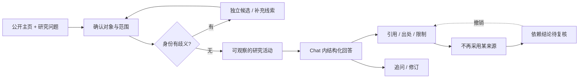

# StripSearch Web 设计

状态：历史交互设计原型。当前 Web alpha 的真实能力见 [Web 运行时契约](web-runtime.md)，本稿不代表完整研究 Agent 已实现。

2026-09-26 新增[人物入口、Person Object 与 DSH 重构提案](design/person-object-2026-09-26/README.md)，系统梳理单输入、条件消歧、低成本研究与三格式输出。该提案尚未替换生产实现；本页保留历史设计依据。

已交付：[最终交互原型](../design/web/index.html) · [设计规范](../design/web/DESIGN.md) · [验证记录](../design/web/VALIDATION.md)。

新增视觉探索（2026-09-21）：[Signal Atlas / Open Dossier](../design/web/next/README.md) 与[多平台状态契约](../design/web/NEXT-DESIGN.md)。用户已选择 A，深化官网图谱、研究引导与配置；B 保留为存档。独立原型使用明确隔离的合成语料 v2，不改变原有 Web alpha 能力与里程碑。

主题：默认跟随系统亮 / 深色；亮色采用纸白与深绿，深色保留黑底荧光绿。首页、Chat、出处面板与移动端抽屉使用同一套主题令牌。

## 访问者与入口

访问者正在准备采访、理解作者的作品，已有一个公开主页，但不确定材料是否属于同一个人、观点是否有实际行动支持。首页需要让其理解：这里既能提出研究问题，也能逐条复核回答依据。

核心承诺沿用产品设计：**理解一个人，沿着证据走。** 感受应是精确、可控、有探索欲；下一步是输入公开主页与问题，或打开合成示例。

“持续归属核查、反证和撤回”是待验证的产品差异，不宣称已优于竞品。原型中的运行状态、报告与来源均为合成演示。

## 两个视觉方向

| 维度 | A · Evidence Terminal | B · Research Observatory |
|---|---|---|
| 主张 | 每一项判断都可以沿证据回溯 | 在时间与上下文中阅读一个人的公开工作 |
| 比喻 | 研究终端，逐步连接问题与证据 | 研究档案，逐页揭示事件与材料 |
| 空间 | 非对称网格、宽输入、编号来源 | 目录边栏、编辑式阅读区、时间切片 |
| 优先内容 | 提问、研究活动、可点击引用 | 研究对象、档案目录、历史变化 |
| 识别交互 | 点击结论引用，出处定位随之展开 | 沿时间选择事件，同时显示同期材料 |
| 避免 | 黑客电影、打字雨、监控大屏、伪终端日志 | 新闻门户、静态 PDF、普通博客 |

已在 Open Design 生成并实际查看 A/B 的桌面首屏、研究内容与 390px 手机折叠。选择 A，保留 B；不把配色变体算作两个方向。

选择依据是研究入口可见性、证据关系与用户指定风格，属于设计判断，不是用户研究结论。B 保留为未经修复的概念原稿，不能当作验收通过的应用。

原稿：[A · Evidence Terminal](../design/web/concept-a.html) · [B · Research Observatory](../design/web/concept-b.html)。

## 首页：问题优先且精简

首选 **输入优先**，并把营销文案压到最低：一句主张、一个问题框、一个可操作示例、一个完整演示出口。

| 段落 | 工作 | 形式与节奏 | 证明与出口 |
|---|---|---|---|
| 首屏 | 说清产品、发起问题 | `想了解谁？` 标题、一行说明、必填问题框、主按钮 | 填示例问题或打开工作台 |
| 出处示例 | 证明结论可回溯 | 一条 Lantern 结论 + S1–S4 来源标签 + 出处预览 | 点击来源更新预览，或看完整示例 |
| 边界 | 交代当前阶段与适用范围 | 紧凑的第二层折叠说明 | GitHub 或返回输入 |

- H1 为 `想了解谁？`；说明为 `查作品、经历和公开观点。每条结论都能点开出处。`
- 研究问题是主体：`你想查什么？` 必填，占位示例 `林舟如何设计 Lantern？`。主按钮 `开始研究`，次按钮 `看示例`。
- 三个示例按钮只负责填入问题并把焦点移回输入框；不出现只改标签、没有输出的研究模式控件。
- 可选 `主页链接` 收在 `添加主页` 折叠中；URL 可空，填写后必须是 `http` / `https` 且 hostname 非空。
- 输入有内容时出现 `清空`，清空后焦点回到输入框；`Cmd/Ctrl + Enter` 提交，忽略输入法组合与按键重复，不重复启动同一轮运行。
- 每个活动视图只保留一个紧凑的 `示例模式` 折叠；展开说明 `人物和资料均为虚构，暂不连接真实检索`。不隐藏合成性质，也不重复堆叠免责声明。
- 不出现 `INPUT / 01`、`SYNTHETIC / 01`、`MECHANISM`、`SELF / WORK / THIRD` 之类装饰编号，也不保留重复的示例营销段落。

## Chat 信息结构

桌面：研究列表 / 对话与结构化回答 / 可收起的出处检查器。中列为主，出处侧栏只在核查时占空间。

移动：单列对话，历史与出处作为独立抽屉；关闭返回触发控件。输入区不覆盖末尾回答，长报告不横向滚动。

研究活动展示读取、核对等可观察步骤与结果，不展示隐式推理；合成演示不会伪装真实工具日志。

## 内容与状态契约

| 对象 | 必须可见 | 不能表达成 |
|---|---|---|
| 身份 | 种子主页、独立候选、归属依据、未确认项 | 同名自动合并 |
| 来源 | 类型、日期、原文、位置、能说明什么、还不能说明什么、状态 | 搜索摘要等于已读正文 |
| 结论 | 支持证据、推断标识、反证与限制 | 人格分或无依据可信度百分比 |
| 运行 | 范围、阶段、暂停/失败/部分结果、真实步骤进度 | 无限假进度或演示等于上线 |
| 撤回 | 被排除来源、受影响结论、就地撤销入口、导出状态 | UI 撤下但报告继续可靠 |
| 追问 | 脚本支持范围与可用预设 | 固定答案冒充理解任意输入 |

工作状态只用中文，并按实际状态派生：`等待确认` / `正在查看资料` / `已暂停` / `已完成` / `N 处待复核`。不出现 `RUNNING`、`COMPLETE`、`LOCAL` 之类内部代码。

状态覆盖：初始空白、输入错误、候选待选、研究活动、停止与继续、失败与重试、有限结果、来源无法访问、无匹配筛选、不再采用来源、追问与新建。

原型不接受真实本地档案，不读取示例域名，不调用供应商或模型。下载与复制都为本地合成 Markdown。正式 Web 应读取同一 canonical report，不能另写一套报告事实。

## 报告与导出

- 报告标题固定为 `这个人是谁` / `做过什么` / `查到的事实` / `可能的解释` / `还不确定`，保留出处引用、本人自述标识以及事实、推断、未知的分列。
- 报告正文删去重复定义，只删冗余表述，不改事实、来源与依赖关系。
- `下载报告` 用本地 Blob 生成同一份 Markdown；`复制报告` 使用 `navigator.clipboard.writeText(buildMarkdown())`，只在报告就绪时可用。
- 复制成功才提示已复制；被浏览器阻断或失败时提示改用 `下载报告`，不谎报成功。
- 导出提示使用独立状态区域，不覆盖研究生命周期状态。

## 来源排除与撤销

- 当前固定夹具只允许排除 S2；主操作文案为 `不采用这条来源`，排除后为 `恢复来源`。
- 排除会同步更新所有依赖它的展示语句、已有回答与导出标记，并在出处面板就地显示 `N 处结论待复核` 与 `撤销`。
- 撤销入口在桌面检查器与移动抽屉内都可用；抽屉打开时背景 `inert` 并保持键盘焦点陷阱。
- 新建研究或重置会清空撤销状态，旧操作不会作用到新报告。
- 选中的来源始终有清晰选中态；原型不伪造打开远程示例 URL。

## 模板、动效与可访问性

使用 Open Design 的 **HUD Design System**，取黑底、精密线条与语义状态。正文使用清晰的中西文无衬线字，16px / 1.65 行高；标签 12–13px；荧光绿只用于行动与引用。

动效强度 5/10，只服务于真实状态：

- 输入聚焦高亮；点击引用后选中来源与原文短暂强调（150–240ms）。
- App、报告与新消息以 150–240ms 的 `opacity` / `transform` 进入。
- 进度条由已完成步骤数驱动，带 `role="progressbar"` 与 `aria-valuenow` / `aria-valuetext`；暂停时保持不动，完成只发生一次。
- 运行指示只在运行中且未暂停时动画；没有无限装饰动画、假打字机或人为延迟。
- `prefers-reduced-motion` 在首屏与偏好变化时都生效，状态仍会更新。

其他约束：触控目标不小于 44×44px；所有主控制有可访问名称与键盘焦点；错误就地显示并移动焦点；状态不只依赖颜色；桌面端不出现冗余 `菜单` 按钮。桌面导航保持单行。

## 调研来源与采用机制

查阅日期：2026-09-20。

- [Linear UI 设计回顾](https://linear.app/now/how-we-redesigned-the-linear-ui)：采用导航、内容与属性面板的层级分工；不复制视觉身份。
- [Exa 官方网站](https://exa.ai)：参考明确的研究工具入口与结构化内容示例；不移植其规模或性能指标。
- [Resend 官方网站](https://resend.com)：参考精练开发者产品定位与直接展示实际界面的表达；不复制其品牌图形。
- Open Design 内置 HUD 与 Mission Control 模板：前者适合本轮终端方向；后者的琥珀色、档案式阅读作为 B 方向素材。

## 验收与后续实现边界

设计验收看真实渲染：桌面与窄屏、首页到 Chat、候选确认、引用检查、失败恢复、复制与下载、来源排除与撤销、键盘关闭抽屉。视觉判断与功能检查分别记录。

正式开发应先稳定报告和作业状态契约，再确定 API、流式事件、持久化与权限。原型里的计时器、合成来源和预设回答不进入真实研究链路。
